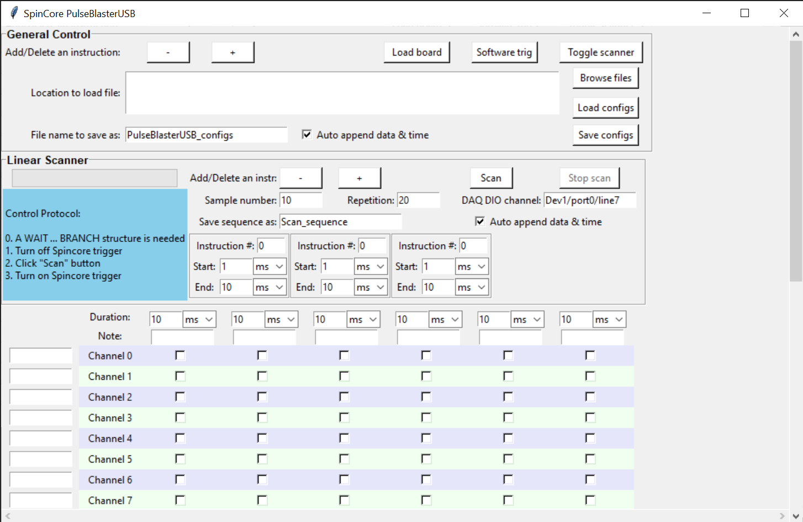

# SpinCore-Python-Control

This GUI is designed to interface with [SpinCore PulseblasterUSB](https://www.spincore.com/products/PulseBlasterUSB/) for pulse generation.

The usage is straightforward: use checkboxes to indicate which channels to be turned on in which time slots. For device specification, _op code_, _op data_, etc. please refer to [product manual](http://www.spincore.com/CD/PulseBlasterUSB/v2/PulseBlasterUSB_v2_manual.pdf). Use _Load board_ button to load configurations into SpinCore PulseBlasterUSB. This User interface also supports saving/loading program settings.

## Linear Scanner
The built-in _scanner_ allows users to scan duration of chosen time slots. Scanning parameters are sampled linearly from user defined _start_ to _end_. Multiple time slots are scanned synchronously. That is to say, although the scan sequence will be randomized, when the first time slot has a certain value, all of following time slots will have their corresponding values (not random) at that moment. This is useful, when, for some reason, we want the total duration of all time slots to be a constant.  We can do it by scanning some time slots in opposite direction. Or another application is that sometimes we want to scan the timing of some channels and leave the other channels uninterrupted. This can be done by splitting the desired time slot into two, and scan them in the opposite direction while keeping total duration to be the same. For channels that need to scan, turn them on in only one (partial) slot; for other channels, turn them on (or off) in both parts.   

The implementation of _Scanner_ depends on loading parameters into hardware in every experimental cycle. To synchronize parameter loading with experimental cycles, the _WAITING_ signal returned by one of SpinCore PulseBlasterUSB's D-sub pins is used. It will be read by a DAQ bufferable DIO channel and trigger the program for new parameter loading. 
